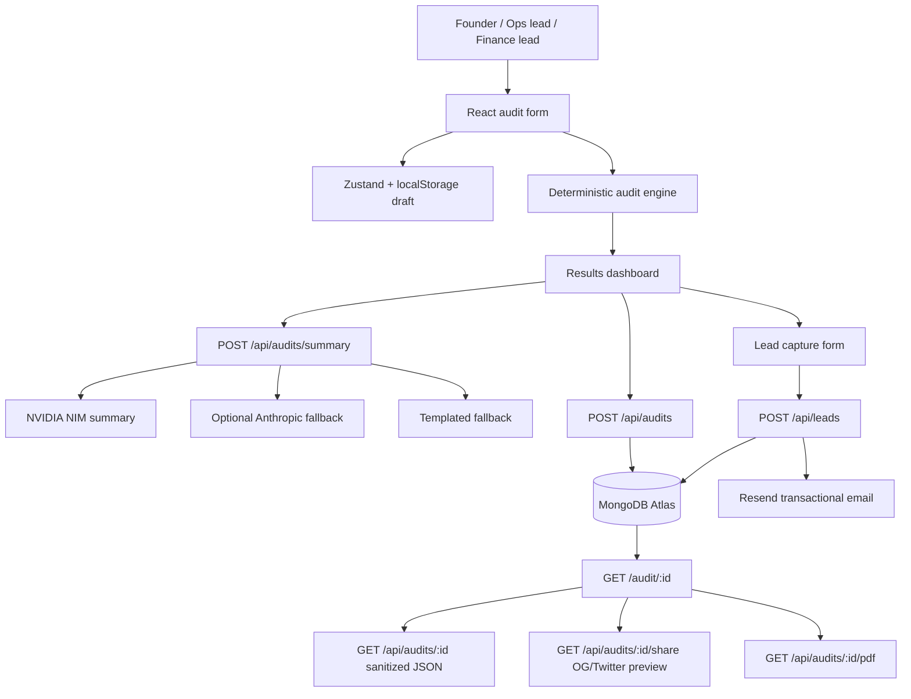

# AuditEX Architecture

## System Diagram



## Data Flow

1. The user enters AI tools, plans, monthly spend, seats, team size, and use case.
2. The frontend normalizes the form into typed `AuditTool` objects.
3. `runAudit` applies deterministic rules for unused seats, benchmark gaps, plan fit, API routing, overlapping categories, and negotiation opportunities.
4. `calculateTotals` sums spend and caps estimated savings at 72 percent of monthly spend.
5. The results page displays the savings hero, per-tool breakdown, recommendations, and charts.
6. The summary endpoint sends only audit facts to NVIDIA NIM for a short paragraph; if providers fail, the backend returns a deterministic fallback summary.
7. Saving the audit stores tools, totals, recommendations, and summary under a unique `auditId`.
8. Public report endpoints return sanitized report data only. Lead details are stored separately and never included in public JSON, share previews, Open Graph images, or PDFs.
9. Lead capture stores contact data, high-savings context, and sends a Resend confirmation email.

## Frontend Framework

AuditEX uses React with Vite and TypeScript.

React was chosen because this product is an interactive audit workflow rather than a static marketing site. The UI needs local form state, persisted audit drafts, conditional results views, animated report sections, shareable report routes, charts, and lead capture. React's component model fits those repeated product surfaces well, while Vite keeps the build simple and fast for a single-page application.

Next.js was not required for the MVP because the backend already owns dynamic share-preview HTML for crawlers at `/api/audits/:id/share`, including Open Graph and Twitter card tags. That lets the public report stay as a React app while still producing clean social previews.

## TypeScript

Both frontend and backend are written in TypeScript.

The audit domain has structured data contracts: tools, plans, recommendations, totals, reports, and leads. TypeScript keeps those contracts explicit across React state, API clients, Express controllers, MongoDB models, PDF export, and share-preview routes. Plain JavaScript was not used because silent shape drift would be risky in the savings calculations and public report payloads.

## UI System

AuditEX does not use website builders, admin dashboard templates, or pre-built product screens.

Allowed libraries used:

- Tailwind CSS for styling primitives and responsive layout
- Framer Motion for focused UI motion
- Recharts for charts
- React Three Fiber and Three.js for the custom visual background
- Lucide React for icons
- React Router DOM for application routes
- Zustand for lightweight client-side audit state

The UI components are project-specific and live in `frontend/src/components`. They are not imported from an admin dashboard template or site builder.

## Backend

The backend uses Express with TypeScript and MongoDB via Mongoose.

Responsibilities:

- Persist audits and generate unique public audit IDs
- Return sanitized public report payloads
- Serve dynamic Open Graph/Twitter share previews
- Export public reports as PDFs
- Store leads separately from public reports
- Send Resend transactional confirmation emails
- Generate AI summary paragraphs with NVIDIA NIM first, optional Anthropic fallback, and deterministic templated fallback
- Apply basic abuse protection through IP rate limiting and a honeypot field

## Public Report Privacy

Lead data is stored separately from audits. Public report responses intentionally include tools, spend, savings, recommendations, summary, and timestamps only. Company name, role, email, and other lead fields are not returned by `/api/audits/:id`, `/api/audits/:id/share`, `/api/audits/:id/og.svg`, or `/api/audits/:id/pdf`.

## Performance And Lighthouse Gate

Target deployed mobile Lighthouse scores:

- Performance: at least 85
- Accessibility: at least 90
- Best Practices: at least 90

Run Lighthouse against the deployed frontend URL after deployment:

```bash
npx lighthouse https://YOUR_DEPLOYED_FRONTEND_URL --preset=desktop
npx lighthouse https://YOUR_DEPLOYED_FRONTEND_URL --form-factor=mobile --screenEmulation.mobile --only-categories=performance,accessibility,best-practices
```

The current repo can be validated locally with:

```bash
npm --prefix frontend run build
npm --prefix frontend run lint
npm --prefix backend run build
```

If the mobile Performance score falls below 85, the first optimization targets are code-splitting chart/3D sections, deferring non-critical animations, and reducing initial JavaScript on the landing and audit form routes.

## Scaling To 10k Audits Per Day

At 10k audits/day, the first change would be to move summary generation and email delivery off the request path. Audit creation would synchronously store the deterministic audit result, then enqueue background jobs for the LLM summary, Resend email, PDF generation, and any CRM routing. The API would use idempotency keys for audit saves, stricter per-IP and per-email rate limits, and a queue-backed retry policy so provider outages do not slow down the core audit flow.

MongoDB would need compound indexes on `auditId`, `createdAt`, `highSavings`, and lead email fields, plus TTL or archival rules for stale anonymous audits. Public report traffic should sit behind CDN caching for `/api/audits/:id/share`, `/api/audits/:id/og.svg`, and PDF assets. The frontend should split the landing, form, results, charts, and 3D code into separate route chunks so first load stays below the Lighthouse target even as reporting surfaces grow.

Operationally, I would add structured logs, error tracking, provider latency metrics, and funnel analytics for audit started, generated, saved, shared, PDF downloaded, lead submitted, and Credex CTA clicked. At that scale, the most important product metric is not raw audit volume; it is high-savings qualified leads that include enough context for Credex to act.
